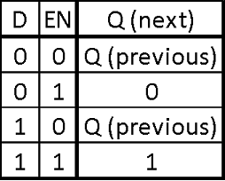
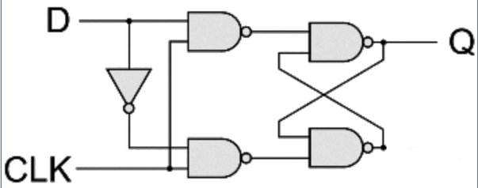
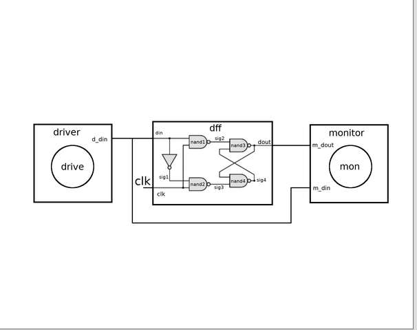
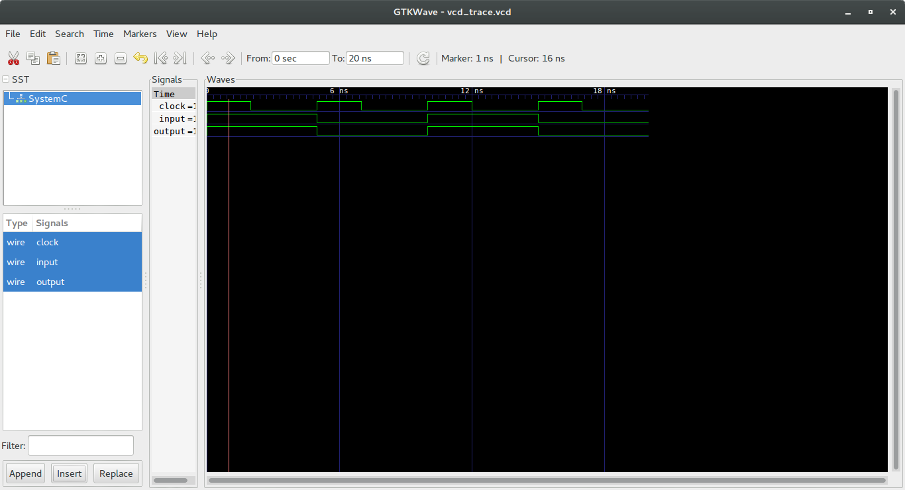

This file explains the working of the D-flipflop. i have added more details inside the dff, which is an inverter gate and 4 instances of nand gates. just cd into this folder and run the command:

    make dff

A D-flopflop captures the value of the D-input at a definite portion of the clock cycle (such as the rising edge of the clock). That captured value becomes the Q output. At other times, the output Q does not change.The D flip-flop can be viewed as a memory cell, a zero-order hold, or a delay line.

 In the truth table shown below, it is clearly seen that the output changes based on the input,and all these changes occur in the presence of a clock signal. 

here is the truth table of a dff:

  

###Circuit:

  

Model of computation:

  

Results:
The above MOC was implemented in systemc (code in this folder) and the following output found from traced signals. 
Traced signals timing diagram:

  

